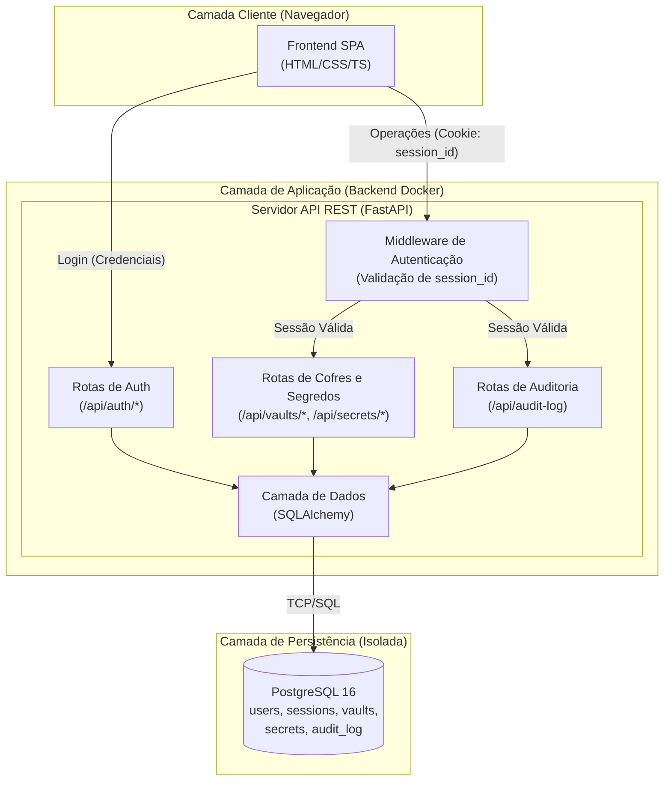
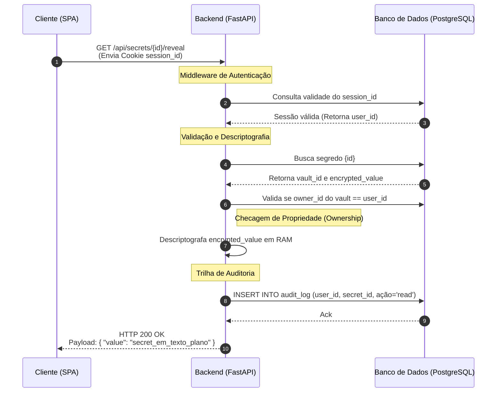
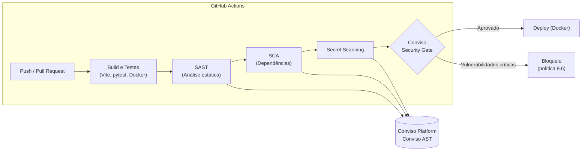

# Arquitetura: Web-Keyring

**Versão:** 1.0

Este documento apresenta o design arquitetural da aplicação Web-Keyring. O sistema atua como um cofre digital para armazenamento, recuperação e auditoria de segredos (tokens de API, credenciais de banco de dados, chaves SSH) destinados a equipes internas de desenvolvimento e infraestrutura.

---

## 1. Visão Geral da Arquitetura

O sistema adota uma arquitetura monolítica tradicional de três camadas. A escolha prioriza o isolamento de rede do banco de dados, a centralização das regras de controle de acesso no backend e a facilidade de auditoria para cada operação de leitura.

O diagrama abaixo detalha os limites do sistema, a divisão de responsabilidades dentro da camada de API e as rotas de comunicação.

---

## 2. Detalhamento dos Componentes

### 2.1. Frontend (SPA)
Desenvolvido em TypeScript puro (empacotado via Vite), sem a utilização de frameworks pesados (como React ou Angular). A renderização baseia-se na manipulação direta do DOM através de módulos de UI reutilizáveis. O estado da aplicação é gerenciado globalmente em memória durante o ciclo de vida da página.

- **Responsabilidade:** Interface de usuário, validações de formulário *client-side* e consumo da API REST.
- **Segurança:** O cliente não armazena segredos em *localStorage* ou *sessionStorage*. Valores confidenciais são mantidos apenas no estado volátil da aplicação e limpos após o uso ou expiração da sessão.

### 2.2. Backend (Servidor de Aplicação)
Construído em Python 3.12 com o framework FastAPI. Atua como o único ponto de entrada para acesso aos dados persistentes.

- **Responsabilidade:** Exposição de endpoints RESTful, validação de requisições, criptografia/descriptografia de payloads, gerenciamento de sessões e aplicação de regras de negócio (validação de *ownership*).
- **Camada de Dados:** Utiliza SQLAlchemy 2.0 (ORM) para a abstração e execução de queries seguras contra injeção de SQL, com controle de migrações gerido pelo Alembic.

### 2.3. Banco de Dados
Servidor PostgreSQL operando em container Docker. A rede deste container não expõe portas para o host, sendo acessível estritamente pelo container da API.

O modelo relacional suporta cinco tabelas principais:
- `users`: Credenciais (`password_hash` via bcrypt).
- `sessions`: Controle de sessões ativas (expiração temporal).
- `vaults`: Agrupamento lógico de segredos (pertencentes a um `owner_id`).
- `secrets`: Armazenamento de itens. O campo `encrypted_value` (`bytea`) guarda o payload sensível protegido por criptografia simétrica.
- `audit_log`: Tabela imutável (append-only) que registra ações cruciais (`read`, `create`, `delete`) mapeadas ao ID do usuário requisitante.

---

## 3. Fluxos Críticos de Sistema

Para demonstrar a mecânica de operação e aplicação dos controles de acesso, detalham-se abaixo os dois fluxos principais da aplicação.

### 3.1. Fluxo de Autenticação (Sessão Baseada em Estado)

A aplicação não utiliza JSON Web Tokens (JWT) armazenados no cliente.

1. O usuário submete credenciais (e-mail e senha) para `/api/auth/login`.
2. A API valida o *hash* da senha armazenado em `users`.
3. A API gera um UUID insere um registro em `sessions`.
4. A API retorna o response contendo um *cookie* `session_id` com os atributos `HttpOnly`, `Secure` e `SameSite=Strict` (detalhados em 3.3). 

### 3.2. Fluxo de Revelação e Auditoria

A leitura de um segredo obedece ao princípio de **revelação sob demanda** (*on-demand reveal*). Os segredos são trafegados individualmente apenas quando requisitados pelo usuário final.

**Mecanismos de Segurança Neste Fluxo:**
- **Prevenção contra IDOR:** A etapa 5 impede que usuários validem requisições de leitura iterando sobre IDs de segredos aleatórios.
- **Rastreabilidade Não-Repudiável:** A etapa 7 é síncrona; o segredo não é retornado caso a escrita no log de auditoria falhe.

### 3.3. Atributos de Segurança do Cookie de Sessão (`HttpOnly`, `Secure`, `SameSite`)

O uso dos atributos do cookie `session_id` consolida as diretrizes de gerenciamento de sessão da aplicação.

Conforme a seção 6.2 da política de segurança, os cookies de sessão deverão utilizar, obrigatoriamente, os atributos `HttpOnly`, `Secure` e `SameSite`, conforme a necessidade da aplicação. No Web-Keyring a combinação aplicada é `HttpOnly`, `Secure` e `SameSite=Strict`.

| Atributo | Valor | Efeito |
|---|---|---|
| `HttpOnly` | `true` | Impede o acesso ao cookie via JavaScript (`document.cookie`), mitigando roubo de sessão por XSS. |
| `Secure` | `true` | O cookie só é transmitido sobre HTTPS/TLS, evitando exposição em tráfego não criptografado. |
| `SameSite` | `Strict` | Restringe o envio do cookie a requisições de mesma origem (primeira parte), mitigando ataques de CSRF. |

**Justificativa de ameaça:** a ausência de `HttpOnly` e `SameSite` configura superfície de ataque para **roubo de sessão** (falhas na gravação de cookies). Reforçando o controle, a política de segurança (seções 6.3 a 6.5) determina que:

- O `session_id` **não** deve ser armazenado em `localStorage` ou `sessionStorage` (somente no cookie `HttpOnly`).
- A sessão deve ter expiração absoluta e por inatividade, com prazo máximo de **6 horas**.
- O identificador deve ser renovado após eventos relevantes de autenticação e invalidado no `logout` no servidor.

---

## 4. Integração Contínua: Pipeline CI/CD (GitHub Actions + Conviso Platform)

A conexão do Web-Keyring com uma pipeline de CI/CD é realizada via **GitHub Actions**, integrada à **Conviso Platform** para varredura de segurança automatizada (Conviso AST) e aplicação de *Security Gate*. 

**Etapas da pipeline:**

1. **Trigger:** push para branches de desenvolvimento ou abertura de *pull requests*.
2. **Build e Testes:** compilação do frontend (Vite), execução dos testes da API (FastAPI/pytest) e build das imagens Docker.
3. **SAST:** análise estática do código-fonte em busca de vulnerabilidades.
4. **SCA:** varredura de bibliotecas e dependências vulneráveis.
5. **Secret scanning:** detecção de segredos e credenciais acidentalmente commitados.
6. **Conviso AST / Security Gate:** envio dos resultados para a Conviso Platform; o *gate* bloqueia o deploy na presença de vulnerabilidades críticas conhecidas (política 9.6).
7. **Deploy:** liberado somente mediante aprovação do *Security Gate* e validação de políticas.

**Conformidade com a política de segurança:** as etapas 3 a 6 atendem às seções 9.3 e 9.4 do `docs/security_policy.md`, que exigem que todo código seja submetido a mecanismos automatizados de análise de segurança (SAST, SCA e secret scanning) e que, após toda modificação significativa, o scan de vulnerabilidades seja documentado na Conviso Platform, com tratamento registrado das vulnerabilidades identificadas (classificação, responsável, prazo e situação).